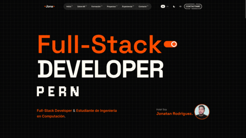

# 🚀 Portafolio Profesional

Un portafolio personal interactivo, moderno y altamente responsivo construido para destacar proyectos, experiencia y habilidades de manera profesional. 



## ✨ Características Principales

*   **🌍 Internacionalización (i18n):** Soporte bilingüe completo (Inglés y Español) mediante contexto nativo de React.
*   **🎨 Temas Personalizables:** Transición fluida entre Modo Oscuro y Claro.
*   **🔊 Experiencia Inmersiva:** Efectos de sonido integrados en las interacciones (con opción de silencio).
*   **⚡ Rendimiento Optimizado:** Desarrollado sobre Vite para tiempos de carga ultrarrápidos y recarga en caliente (HMR).
*   **📱 Diseño Responsivo:** Estilos adaptables a cualquier dispositivo móvil, tablet o escritorio, desarrollados con Tailwind CSS.
*   **🧩 Arquitectura Modular:** Separación clara entre estado global (Contextos), componentes UI genéricos, y vistas (Secciones).

## 🛠️ Tecnologías y Herramientas

*   **Core:** React, TypeScript
*   **Estilos:** Tailwind CSS, PostCSS
*   **Build Tool:** Vite
*   **Calidad de Código:** Oxlint, ESLint

## 🚀 Instalación y Uso

Sigue estos pasos para desplegar el entorno de desarrollo en tu máquina local:

1. **Clonar el repositorio:**
   ```bash
   git clone <URL_DEL_REPOSITORIO>
   cd portafolio
   ```

2. **Instalar dependencias:**
   ```bash
   npm install
   ```

3. **Ejecutar el servidor de desarrollo:**
   ```bash
   npm run dev
   ```

4. **Construir el proyecto para producción:**
   ```bash
   npm run build
   ```

## 📁 Estructura del Proyecto

```text
├── public/
│   ├── img/          # Imágenes del proyecto y UI (ej. portafolio.png, profile.jpg)
│   └── sounds/       # Efectos de sonido (click, switch, toggle)
├── src/
│   ├── components/   # Componentes reutilizables (layout, badges, cards modales)
│   ├── context/      # Estados globales (LanguageContext, ThemeContext, SoundContext)
│   ├── data/         # Mock de datos (educación, experiencia, proyectos, skills)
│   ├── hooks/        # Custom hooks (useScrollProgress, useSound, etc.)
│   ├── i18n/         # Archivos de traducción (en.ts, es.ts)
│   └── sections/     # Secciones de la landing page (Home, About, Work, etc.)
└── package.json
```

## 👨‍💻 Autor

Desarrollado por **Jonatan Rodriguez**.